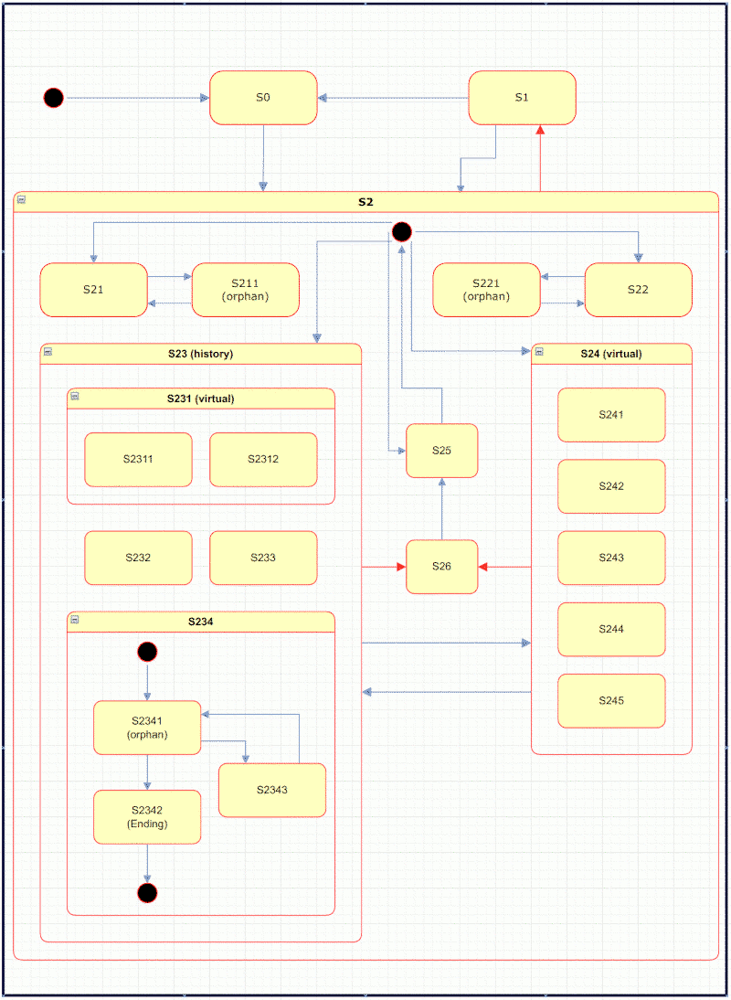
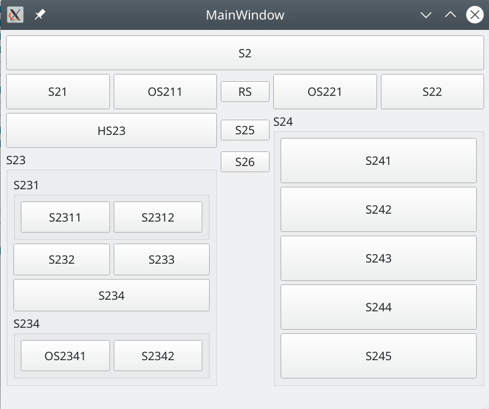

# StateMachine

## Specification
Implementation of a hierarchical state machine
- each state is a node, that could have statetransitions attached
- statemachine is itself a state
- if statemachine is requested to activate a state, it looks for the attached statetransitions. If the state has no matching transition for the request, its parent will be asked for statetransitions (aka hierarchical)
- Special nodes:
 - EndingState - is used as endpoint of a process
 - HistoryState - is used as conditial guard in the sense, that state to check must be an entry of statemachines history (has to be active in the past). HistoryStateTransition may form a positive or negative condition
 - OrphanState - is used to bypass hierarchy. As orphans have no parents, an OrphanState will never ask a parent for state transitions.

### **StateMachine** is build as a library with unittests and sample application.

 .

### Setup

        void BasicsTests::initTestCase() {
          sm = new StateMachine();

          // state has a name and a parent state
          State* s1 = new State("S1", sm);
          State* s2 = new State("S2", sm);
          State* s3 = new State("S3", sm);

          sm->setInitialState(s1);
          // simple transition consist of an ID and a target state
          s1->addTransition(2, s2);
          s2->addTransition(3, s3);
          s3->addTransition(1, s1);
          }

### State-Change

        // state will be requested by an event with the registered ID
        sm->dispatch(StateRequestEvent(2));

### Prototype

- Pushbuttons simulate state change requests and application output shows the events that happen at each state change.

- **S2** is the first button, that needs to be pressed. Callback of the bound event enables some more buttons.

- **OS211** is an orphaned state, which can be enabled from active **S21** only. Once enabled, **S21** is the only valid state to leave **S211** (similar is true for *OS221*).

- **HS23** is a history state, which means, that all states starting with "23" can be activated only when HS23 has been pushed before.

- **S231** is a virtual state, which means, the only difference between S232 and S2311 is, that S2311 additionally enters and leaves virtual state S231 (with corresponding onEnter/onExit events).

- **OS2341** is an orphaned state, which can be activated from S234 only. S234 can be left to any other state, but OS2341 can only be left by activating ES2342.

- **ES2342** is an EndingState - which means, on activation S2342 is entered and left to activate parent state S234, which then could be left to any other state.
